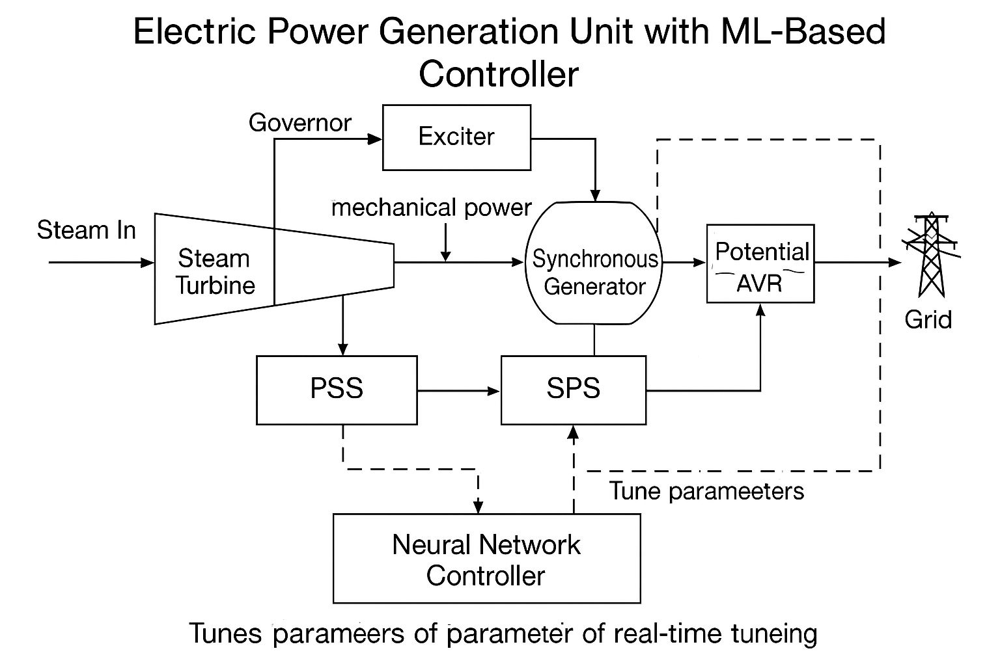
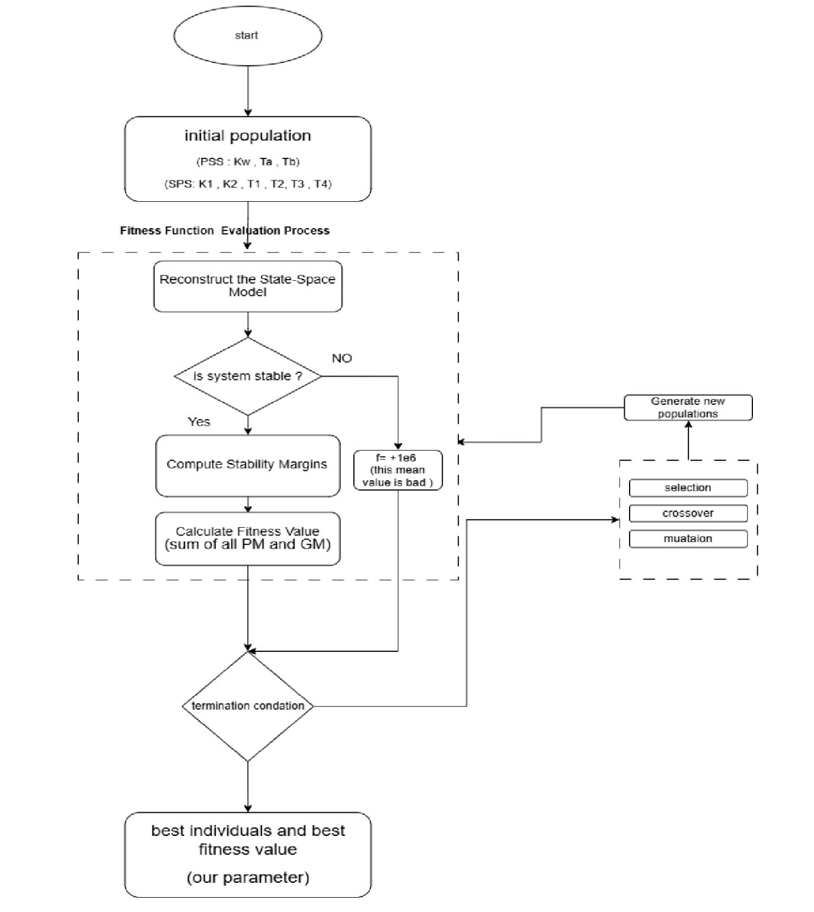

# ⚡ Power System Stability Optimization using Genetic Algorithm & AI

This project combines MATLAB-based simulation and optimization using a Genetic Algorithm (GA) with a Python-based AI model to enhance the dynamic stability of power systems. Parameters of the Power System Stabilizer (PSS) and Static Phase Shifter (SPS) are tuned offline via GA and then predicted in real time by an AI model based on load (PL) and power factor (PF).

---

## 📚 Table of Contents

- [Prerequisites](#prerequisites)
- [Installation](#installation)
- [Project Structure](#project-structure)
- [Overview](#overview)
- [System Architecture](#system-architecture)
- [How It Works](#how-it-works)
- [Usage](#usage)
  - [MATLAB GA Optimization](#matlab-ga-optimization)
  - [Dataset Generation](#dataset-generation)
  - [Python Inference](#python-inference)
- [Results](#results)


---

## 🔧 Prerequisites

- **MATLAB R2024b+** with the following Toolboxes:
  - Global Optimization Toolbox
  - Control System Toolbox
- **Python 3.10+** (Requires installation of the following libraries: `numpy`, `pandas`, `scikit-learn`, `matplotlib`, `tensorflow`, `joblib`)


---

## 🚀 Installation

1. **Clone the repository**
   ```bash
   git clone https://github.com/Eng-Yousef-Mohamed/power-system-stability-optimization-using-GA-AI.git
   cd power-system-stability-optimization
   ```
2. **MATLAB setup**: Ensure MATLAB’s current folder or path includes the `matlab_ga_model/` and `dataset_generation/` directories.

---

## 📁 Project Structure

```plaintext
power-system-stability-optimization/
├── matlab_ga_model/             # MATLAB GA optimization scripts
│   └── optimize_controller.m    # Main GA tuning script
│
├── dataset_generation/          # Loop over load & PF to build dataset
│   └── generate_dataset_loop.m  # Calls GA script per (PL, PF)
│
├── data/
│   └── GA_results.csv           # Output: PL, PF → optimal parameters
│
├── ai_model/                    # Python AI prediction model
│   ├── requirements.txt         # Python dependencies
│   ├── main.py                  # Train & evaluate model
│   ├── use_model.py             # CLI for inference
│   └── model/                   # Trained artifacts
│       ├── controller_model.h5  # Keras model
│       ├── scaler_X.save        # Input scaler
│       └── scaler_y.save        # Output scaler
│
├── images/                      # Diagrams and result plots
│   ├── system_architecture.png  # Full system block diagram
│   ├── ga_flowchart.png         # GA flowchart
│   └── results                 
│
├── LICENSE                      # MIT License file
└── README.md                    # Project documentation (this file)
```

---

## 🧠 Overview

This project aims to improve power system stability by tuning PSS and SPS controller parameters. The workflow is:

1. **Model** a synchronous generator, excitation, transmission, PSS, and SPS in MATLAB.
2. **Optimize** nine controller parameters via a Genetic Algorithm to maximize Gain Margin (GM) and Phase Margin (PM).
3. **Generate** a dataset mapping (PL, PF) → optimal parameters.
4. **Train** a Python-based AI model to predict optimal parameters instantly for new operating points.

---

## 🏗️ System Architecture

The simulation includes:

- **Synchronous Generator**
- **Excitation System**
- **Transmission Line**
- **Power System Stabilizer (PSS)**
- **Static Phase Shifter (SPS)**

The GA optimizes the following nine parameters:

```
Kw, Ta, Tb, k1, K2, T1, T2, T3, T4
```

### 🖼️ Full System Diagram



### 🗂️ GA Flowchart



---

## ⚙️ How It Works

1. **GA Optimization**: `optimize_controller.m`

   - Defines parameter bounds and GA options.
   - Evaluates fitness based on GM & PM from frequency response.
   - Outputs optimal set for given (PL, PF).

2. **Dataset Generation**: `generate_dataset_loop.m`

   - Iterates PL = [0.6:0.1:1.0], PF = [0.8:0.05:1.0]
   - Calls GA script and appends results to `GA_results.csv`.

3. **AI Model**:

   - Loads `GA_results.csv` into Python (pandas).
   - Trains a neural network (Keras) to map [PL, PF] → parameter vector.
   - Saves model and scalers for inference.

---

## ▶️ Usage

### MATLAB GA Optimization

```matlab
% In MATLAB command window or script
optimize_controller;  % runs GA for default PL, PF
```

### Dataset Generation

```matlab
% Generate full dataset
generate_dataset_loop;
```

### Python Inference

```bash
# Predict optimal parameters for PL=0.85, PF=0.95
python ai_model/use_model.py --pl 0.85 --pf 0.95
```

---


## 📈 Results

### GA 


